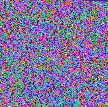

# PixelCipher

PixelCipher is a C++ tool that encodes text into images by mapping characters to pixel colors. It provides a simple form of visual encryption, turning data into colored patterns that can be decoded back to text. Lightweight, fast, and ideal for basic [steganography](https://en.wikipedia.org/wiki/Steganography) .

---

## Example Code

A minimal example showing how to load a [UTF-32 ](https://en.wikipedia.org/wiki/UTF-32) text file and convert it into an encrypted image using `PixelCrypt`:

```cpp
#include <iostream>
#include "PixelCrypt.h"

int main() {
    std::u32string text = loadUTF32FromFile("./Book/Universal_Declaration_of_Human_Rights.txt");

    PixelCrypt pc;

    pc.processsString(text); // outputs the resulting images in the same folder as the source text 
}
```

---

## Encrypted Works

Below are examples of famous texts and lyrics that have been visually encrypted using PixelCipher. Each entry includes the source and its corresponding `Data.bmp` output.

| Title                                      | Author/Source       | Encrypted Image                                                                          |
| ------------------------------------------ | ------------------- | ---------------------------------------------------------------------------------------- |
| [Moby Dick](https://www.gutenberg.org/ebooks/2701)                        | Herman Melville     |                             |
| [Dracula](https://www.gutenberg.org/files/345/345-h/345-h.htm)           | Bram Stoker         |                                      |
| [The Adventures of Sherlock Holmes](https://www.gutenberg.org/cache/epub/1661/pg1661.txt) | Arthur Conan Doyle  |                              |
| [Relativity: The Special and General Theory](https://www.gutenberg.org/ebooks/5001) | Albert Einstein     |  |
| [The Complete Works of William Shakespeare](https://www.gutenberg.org/cache/epub/100/pg100.txt) | William Shakespeare |                          |
| [PBCV‑1 genome (NC_000852.5)](https://www.ncbi.nlm.nih.gov/nuccore/NC_000852.5) | *Paramecium bursaria* Chlorella virus 1 |                               |
| [Universal Declaration of Human Rights](https://www.un.org/en/about-us/universal-declaration-of-human-rights) | United Nations      |        |
| [Bohemian Rhapsody (Lyrics)](https://genius.com/Queen-bohemian-rhapsody-lyrics) | Queen               |                            |


---

## To-Do (Future Features)

- Decode image back to text  
- Set custom image size and padding  
- Use custom color palettes  
- Batch convert many files  
- Add password lock  
- Make a simple GUI  
- Check for decode errors  
- Store title/author in image  

---
## File Structure

Each encoded text has a corresponding `Data.bmp` (visual data) and `Key.bmp` (color-key mapping) located in subfolders under `Book/` or `Song/`. These image pairs are generated by the PixelCipher tool and can be decoded back to the original text using the same key logic.
