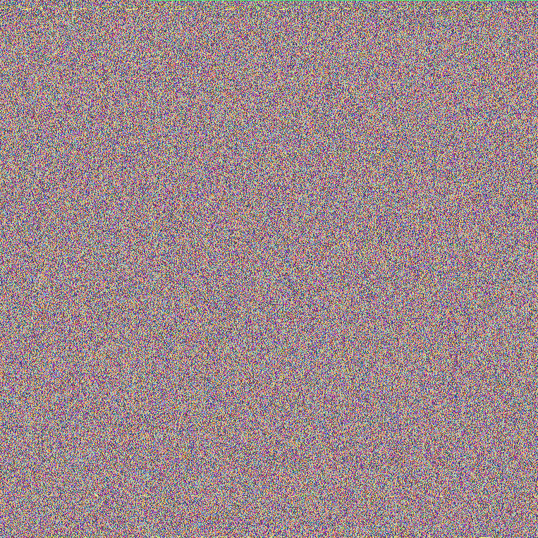
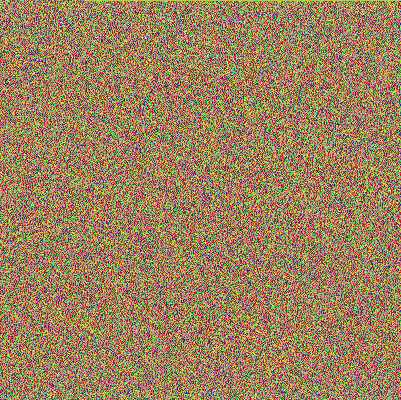

# PixelCipher

PixelCipher is a C++ tool that encodes text into images by mapping characters to pixel colors. It provides a simple form of visual encryption, turning data into colored patterns that can be decoded back to text. Lightweight, fast, and ideal for basic steganography.

---

## Encrypted Works

Below are examples of famous texts and lyrics that have been visually encrypted using PixelCipher. Each entry includes the source and its corresponding `Data.bmp` output.

| Title                                      | Author              | Encrypted Image                                                                          |
| ------------------------------------------ | ------------------- | ---------------------------------------------------------------------------------------- |
| Moby Dick                                  | Herman Melville     |                                   |
| Dracula                                    | Bram Stoker         |                                            |
| The Adventures of Sherlock Holmes          | Arthur Conan Doyle  |                                    |
| Relativity: The Special and General Theory | Albert Einstein     |  |
| The Complete Works of William Shakespeare  | William Shakespeare |                                |
| Paramecium bursaria Chlorella virus        | ncbi               |                                  |
| Universal Declaration of Human Rights      | United Nations      |              |
| Bohemian Rhapsody (Lyrics)                 | Queen               |                                  |

---

## Example Code

A minimal example showing how to load a UTF-32 text file and convert it into an encrypted image using `PixelCrypt`:

```cpp
#include <iostream>
#include "PixelCrypt.h"

int main() {
    std::u32string text;

    text = loadUTF32FromFile("./Book/Universal_Declaration_of_Human_Rights.txt");
    std::cout << "First char code: " << static_cast<uint32_t>(text[0]) << '\n';

    PixelCrypt pc;

    pc.processsString(text);
}
```

---

## File Structure

Each encoded text has a corresponding `Data.bmp` (visual data) and `Key.bmp` (color-key mapping) located in subfolders under `Book/` or `Song/`. These image pairs are generated by the PixelCipher tool and can be decoded back to the original text using the same key logic.
