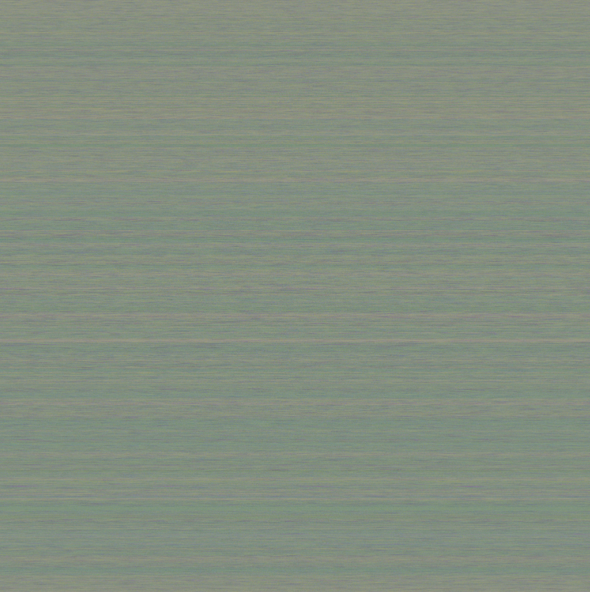

# SteganoPixelCrypt

**SteganoPixelCrypt** is a **C++** tool that visually encrypts text by converting each character into a pixel color.  
It transforms entire documents into colored patterns that can later be decoded back to the original content.  
**Lightweight**, **fast**, and ideal for basic [steganography](https://en.wikipedia.org/wiki/Steganography).

It supports the full **32-bit Unicode range** ([UTF-32](https://en.wikipedia.org/wiki/UTF-32)),  
covering all **4,294,967,296 code points**, including:

- **Chinese**: 你, 爱, 学, 生  
- **Japanese**: 日, 本, 語, 学  
- **Arabic**: ع, م, ر, ب  
- **Russian**: Ж, Д, Р, Я  
- **Emojis**: 😊, 🚀, 🔥, 💡  
- **Symbols**: ∞, §, ©, ✓  
- **Private-use**, **rare**, and **unassigned** characters

---

## Example Code

A minimal example showing how to load a [UTF-32](https://en.wikipedia.org/wiki/UTF-32) text file  
and convert it into an encrypted image using `PixelCrypt`:

```cpp
#include "PixelCrypt.h"

int main() {
    std::u32string text = loadUTF32FromFile("./Book/Universal_Declaration_of_Human_Rights.txt");

    PixelCrypt pc;
    pc.processString(text); // Outputs image(s) in the same folder as the source text
}
```

---

## Encrypted Works

Below are examples of famous texts, songs, and sequences visually encrypted using **PixelCipher**.  
Each entry includes a source link and its corresponding `Data.bmp` output.

| Title                                                                                   | Author/Source                                 | Encrypted Image                                                                 |
|-----------------------------------------------------------------------------------------|-----------------------------------------------|----------------------------------------------------------------------------------|
| [Moby Dick](https://www.gutenberg.org/ebooks/2701)                                      | Herman Melville                               |                  |
| [Dracula](https://www.gutenberg.org/files/345/345-h/345-h.htm)                          | Bram Stoker                                   |                           |
| [The Adventures of Sherlock Holmes](https://www.gutenberg.org/cache/epub/1661/pg1661.txt)| Arthur Conan Doyle                            |                  |
| [Relativity: The Special and General Theory](https://www.gutenberg.org/ebooks/5001)     | Albert Einstein                               |  |
| [The Complete Works of William Shakespeare](https://www.gutenberg.org/cache/epub/100/pg100.txt) | William Shakespeare                    |              |
| [Homo sapiens DNA](https://www.ncbi.nlm.nih.gov/datasets/taxonomy/9606/)                | NCBI                                           |  |
| [PBCV‑1 genome (NC_000852.5)](https://www.ncbi.nlm.nih.gov/nuccore/NC_000852.5)          | *Paramecium bursaria* Chlorella virus 1       |                   |
| [1 Billion Digits of Pi](https://stuff.mit.edu/afs/sipb/contrib/pi/pi-billion.txt)      | 1,000,000,000 Digits of π                      |                               |
| [Universal Declaration of Human Rights](https://www.un.org/en/about-us/universal-declaration-of-human-rights) | United Nations               |  |
| [Bohemian Rhapsody (Lyrics)](https://genius.com/Queen-bohemian-rhapsody-lyrics)         | Queen                                          |                |

**Note:** All entries are in the public domain except *Bohemian Rhapsody* by Queen, which is copyrighted.  
Use it for educational and demonstration purposes only.


---

## To-Do (Future Features)

- Decode image back to text  
- Set custom image size and padding  
- Use custom color palettes  
- Batch convert many files  
- Add password lock  
- Make a simple GUI  
- Check for decode errors  
- Store title/author in image  

---
## File Structure

Each encoded file generates two outputs:
- `Data.bmp`: the visual representation of the text
- `Key.bmp`: the color-key mapping used for decoding

These are saved in subfolders like `Book/`, `Song/`, or `Dna/`, next to the source text.  
They can later be decoded back using the same key.

---
## Build & Run

### Windows
```bash
g++ -std=c++17 -o main.exe main.cpp -Wall
./main.exe
```

### macOS / Linux
```bash
g++ -std=c++17 -o main main.cpp -Wall
./main
```

